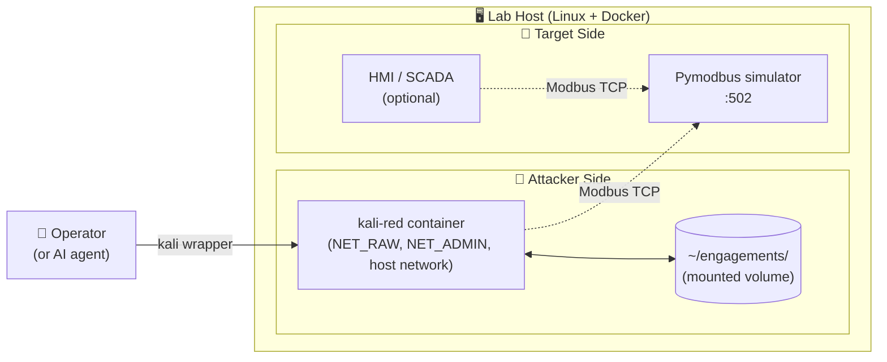

# OT Security Lab

> A dedicated, reproducible **Operational Technology (OT) / Industrial Control System (ICS) security lab** built around a hardened Kali container, a simulated PLC target, and an AI-assisted engagement workflow.

[](LICENSE)
[]()
[]()

---

## Why This Lab Exists

Operational Technology security is fundamentally different from IT security:

- 🏭 **The targets are physical processes.** A misfired test can damage equipment, hurt people, or contaminate output.
- 🕰️ **Lifecycles measured in decades.** PLCs from the 1990s still run critical infrastructure. Many speak protocols designed before "authentication" was a concept.
- 🔓 **Modbus, DNP3, S7, EtherNet/IP — most have no authentication at all.** Anyone on the wire can read or write process variables.
- 📚 **OT security skills require hands-on practice in safe environments.** You cannot learn this on production.

This repo gives you a **complete, reproducible OT security lab** — a target environment, a red-team rig, and an engagement methodology — so you can develop those skills without risk.

### Who This Is For

- 🎓 Security students learning ICS/OT
- 🔬 Researchers exploring industrial protocol weaknesses
- 🏭 OT engineers wanting to understand how their systems can be attacked
- 🛡️ Blue-teamers building detection rules against realistic ICS attacks
- 🧪 Anyone preparing for GICSP, GRID, or similar certifications

### What This Is **Not**

- ❌ **Not** a tool for attacking production infrastructure
- ❌ **Not** a substitute for proper authorization on real engagements
- ❌ **Not** legal advice on penetration testing in your jurisdiction

---

## What You Get

| Component | Purpose |
|---|---|
| 🐳 **`kali-red` container** | Hardened Kali derivative with the full ICS attack arsenal pre-installed |
| 🎯 **Pymodbus simulator target** | Safe, realistic Modbus TCP device to practice against |
| 📜 **Engagement playbooks** | Step-by-step recon → enumeration → exploitation → reporting |
| 🗺️ **MITRE ATT&CK for ICS mapping** | Map every finding to the standard framework |
| 📊 **Report templates** | Professional deliverable formats |
| 🤖 **Optional AI assistant integration** | OpenClaw agent workspace files |

---

## Architecture at a Glance



See [`docs/ARCHITECTURE.md`](docs/ARCHITECTURE.md) for the full diagrams.

---

## Quick Start

**Prerequisites:** Linux host (Ubuntu 22.04+ tested), Docker 24+, ~6 GB free disk, isolated lab network.

```bash
# 1. Clone
git clone https://github.com/<you>/ot-security-lab.git
cd ot-security-lab

# 2. Build the kali-red container
docker build -t kali-red:latest docker/kali-red/

# 3. Start the lab target (Pymodbus simulator)
docker compose -f docker/lab-target/compose.yml up -d

# 4. Start the attacker container
./scripts/start-kali-red.sh

# 5. Install the wrapper
sudo install -m 0755 scripts/kali /usr/local/bin/kali

# 6. Verify
kali nmap -sV -p 502 <target-ip>
```

Full instructions: [`docs/SETUP.md`](docs/SETUP.md).

---

## Documentation Map

```
docs/
├── ARCHITECTURE.md      # System design, network topology, data flow diagrams
├── SETUP.md             # Step-by-step replication guide
├── METHODOLOGY.md       # Engagement methodology, tactics, MITRE mapping
├── TOOLING.md           # Full tool inventory + when to use what
├── SAFETY.md            # Rules of engagement, lab hygiene, what NOT to do
└── AI_ASSISTANT.md      # Optional: integrating an AI agent (OpenClaw)

playbooks/
├── 01-recon.md          # Network discovery & ICS port mapping
├── 02-enumeration.md    # Device fingerprinting, slave-ID walks
├── 03-modbus-ops.md     # Read/write operations, function code mapping
├── 04-mitm.md           # Adversary-in-the-middle techniques
├── 05-dos.md            # Denial-of-service testing (destructive!)
└── 06-reporting.md      # Building the engagement report

reports/templates/
├── engagement-report.md # Deliverable template
└── attck-mapping.md     # MITRE ATT&CK for ICS findings table
```

---

## Safety First

⚠️ **This lab assumes an isolated network.** Test only against systems you own or have written authorization to test.

Read [`docs/SAFETY.md`](docs/SAFETY.md) before running any disruptive test.

**Hard rules:**

1. No tests against production
2. No tests against IPs outside the lab subnet
3. Snapshot state before any write operation
4. Log every command
5. When in doubt, stop

---

## License

MIT — see [LICENSE](LICENSE). Use responsibly.

## Acknowledgments

- The Kali Linux team for the platform
- The pymodbus project for an excellent reference implementation and simulator
- MITRE for the ATT&CK for ICS framework
- The OT security community for years of public research

---

_This is a personal lab. The contents reflect one practitioner's setup, not an official methodology._
