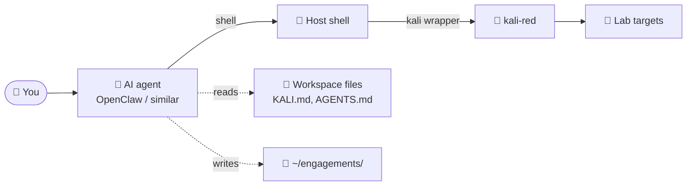

# AI Assistant Integration (Optional)

This lab was originally built alongside [OpenClaw](https://docs.openclaw.ai), an agentic AI workspace. The AI assistant integration is **optional** — the lab works fine without it. But if you want a copilot for engagement work, here's how to set it up.

---

## Why Use an AI Assistant?

In a long engagement, a lot of time goes to:

- Remembering the right `nmap` script names
- Formatting output files consistently
- Tracking what's been done and what hasn't
- Mapping findings to MITRE techniques
- Writing the report

An AI agent that lives in your shell, knows the methodology, and has access to the tools can take a lot of that load — and is genuinely useful for OT security practice because:

1. The protocol space is large and easy to forget
2. The MITRE ATT&CK for ICS technique catalog is wide
3. Repetitive log-writing benefits from automation
4. A "second pair of eyes" before destructive tests is valuable

---

## What's Provided

This repo includes example OpenClaw workspace files under `ai-assistant/openclaw/`:

```
ai-assistant/openclaw/
├── KALI.md      # Container-aware playbook (lives at workspace root)
├── TOOLS.md     # Local environment notes
├── AGENTS.md    # Agent behavior conventions
└── SOUL.md      # Optional persona file
```

Copy these to your home directory (the OpenClaw workspace root):

```bash
cp ai-assistant/openclaw/* ~/
```

---

## Behavioral Guardrails (Important)

If you give an AI agent access to your shell **and** the `kali-red` container, you have given it the ability to take destructive actions against the lab — and potentially beyond it if your network isolation slips.

**Bake the safety rules into the assistant's workspace files:**

- "Read-only by default; writes require explicit per-test approval"
- "Never target IPs outside the documented lab subnet"
- "Snapshot before write; log every write"
- "Stop and ask if uncertain"

These are exactly the same rules a human operator follows. They have to apply to the agent too.

The provided `AGENTS.md` and `KALI.md` files include these rules. Review them before pointing an agent at the lab.

---

## Recommended Setup



The agent:
- Reads `KALI.md` for the toolset and recipes
- Reads `AGENTS.md` for behavior conventions
- Reads `scope.md` for engagement boundaries
- Writes to `engagements/<name>/notes.md` and `writes.log`
- Asks before any disruptive test

---

## Other AI Assistants

The same files work as system-prompt context for any AI assistant. Adapt as needed:

- Claude Code / Cursor — drop the content into `.cursor/rules/` or `CLAUDE.md`
- Custom integrations — load `KALI.md` as a tool/skill reference

---

## What Not to Do

- ❌ Don't give an AI assistant credentials to production OT systems
- ❌ Don't let an agent autonomously run destructive tests
- ❌ Don't disable the "ask before write" guardrail
- ❌ Don't assume the agent's MITRE mappings are correct — verify against the official matrix
