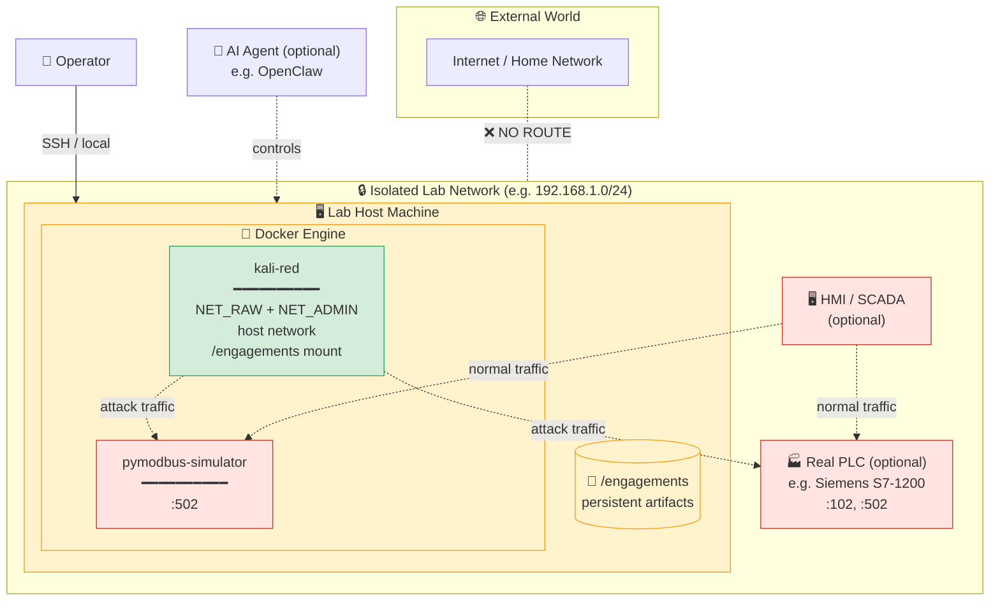
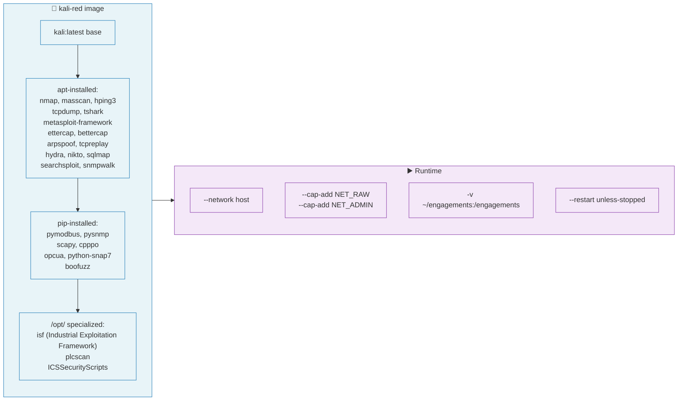
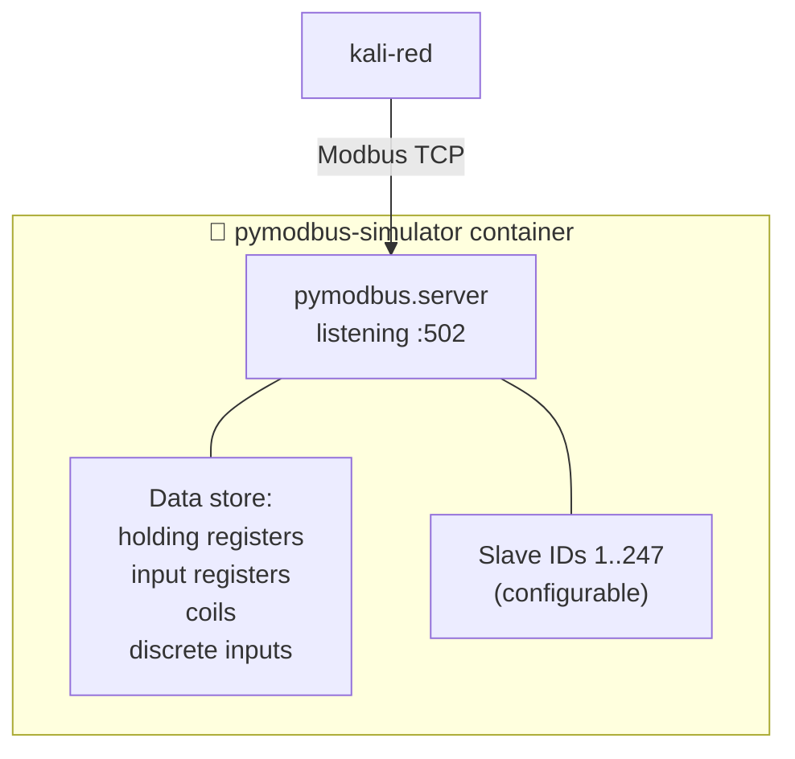
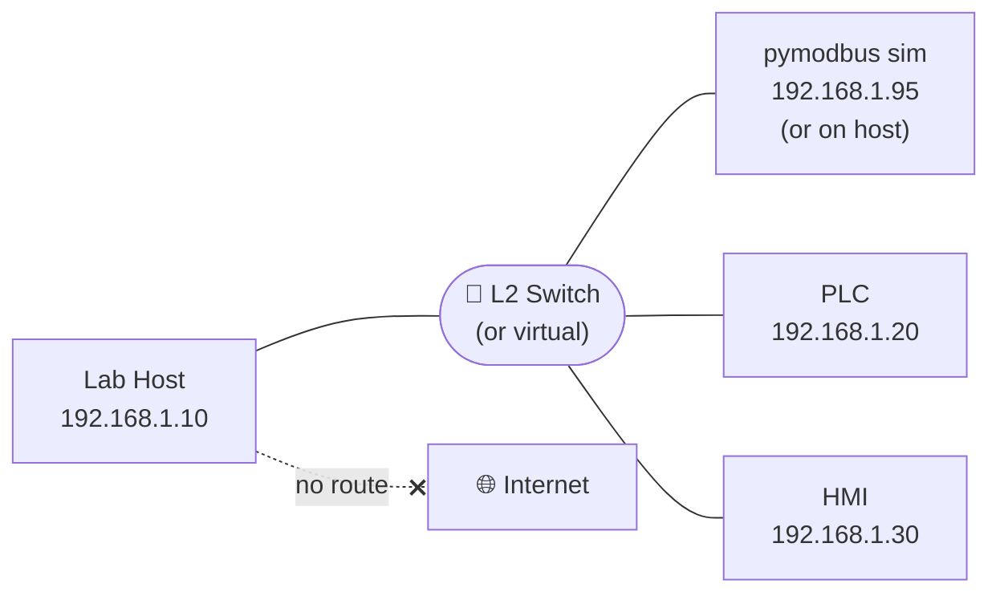
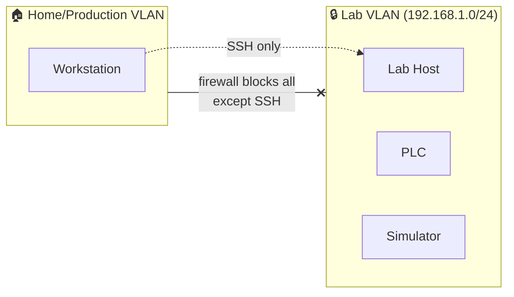
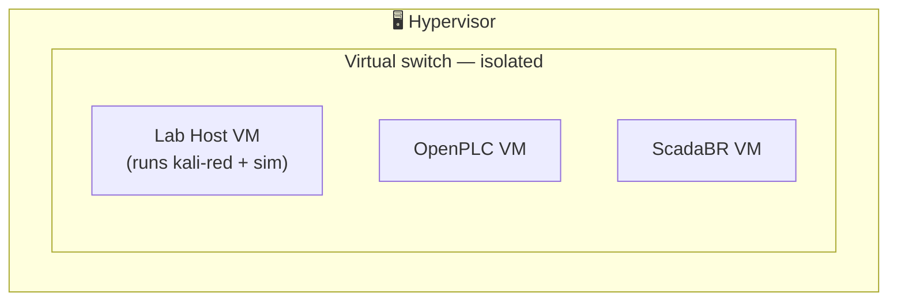
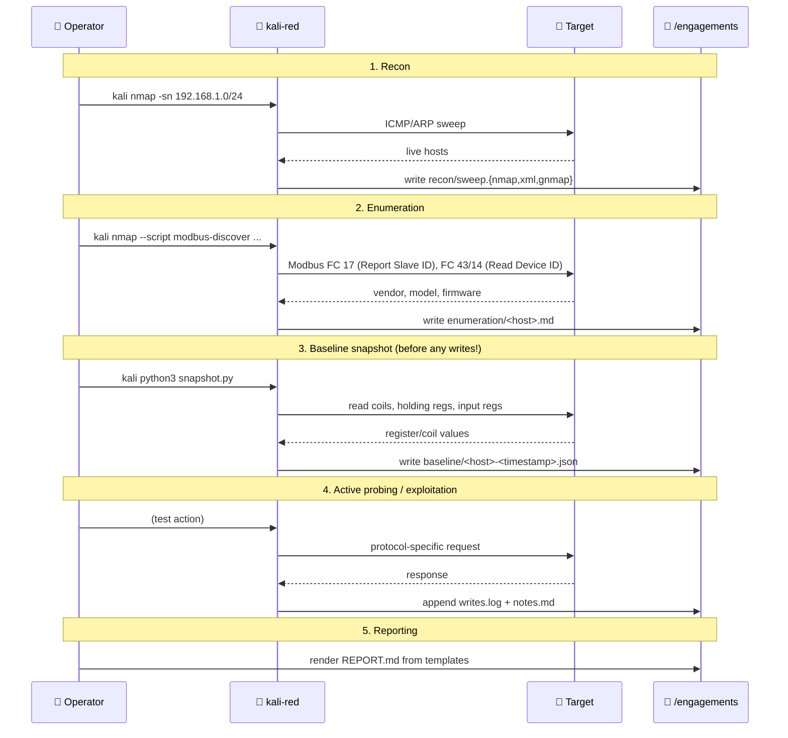

# Architecture

This document describes the design of the OT security lab — what runs where, how the pieces talk to each other, and the security boundaries that keep lab activity from leaking out.

## Design Principles

1. **Containment over capability.** Every tool that exists in the lab should be containable. The attacker rig is a container precisely so it can be torn down and rebuilt deterministically.
2. **Realistic protocols, safe targets.** Use real industrial protocol stacks (pymodbus, OpenPLC, etc.), not toy mockups — but always against simulators, never against equipment you can't afford to lose.
3. **Reproducibility.** Every component is defined by a `Dockerfile`, a `compose.yml`, or a versioned script. No "works on my machine" steps.
4. **Audit by default.** Every command, every capture, every state-change is written to disk under `engagements/`.
5. **Network isolation.** The lab subnet is air-gapped or at minimum VLAN-segmented from production.

---

## High-Level Topology

**Key boundaries:**

- 🛑 **Lab ↔ Internet:** no route. Either fully air-gapped or strict egress firewall rules.
- 🐳 **Container ↔ Host:** the `kali-red` container runs with `--network host`. This is a deliberate trade-off — it gives us real lab-subnet access for raw scans and MITM, but means container processes share the host's network namespace. **Run the lab host only on the lab network**.
- 📁 **Container ↔ Filesystem:** only `/engagements` is mounted. The container has no other write paths to the host.

---

## The Attacker Container — `kali-red`

### Why these capabilities?

| Capability | What it unlocks | Why we need it |
|---|---|---|
| `NET_RAW` | Raw socket creation | nmap SYN scans, hping3, scapy packet crafting, NSE raw-packet scripts |
| `NET_ADMIN` | Interface manipulation | arpspoof, ettercap MITM, custom routing for transparent proxies |
| `--network host` | Direct host network namespace | Reaching the lab subnet without container NAT overhead; required for MITM and broadcast discovery |

### Why these protocol libraries?

| Library | Protocol | Used For |
|---|---|---|
| `pymodbus` | Modbus TCP/RTU | Reading/writing PLC registers and coils |
| `python-snap7` | Siemens S7 | Talking to S7-300/400/1200/1500 PLCs |
| `cpppo` | EtherNet/IP, CIP | Rockwell / Allen-Bradley devices |
| `opcua` | OPC UA | Modern industrial middleware |
| `pysnmp` | SNMP | Many PLCs expose management via SNMP |
| `scapy` | Anything you can craft | Protocol fuzzing, custom packet generation |
| `boofuzz` | Generic fuzzing | Function-code fuzzing on industrial protocols |

---

## The Target Side

### Default target: Pymodbus Simulator

The pymodbus simulator is the **default safe target**. It is a high-fidelity Modbus TCP server with configurable register maps, identification strings, and slave IDs. It will not break, will not contaminate any physical process, and can be restored from a config file in seconds.

### Optional: Real PLC

For more realistic engagements, add a real low-cost PLC to the lab subnet:

- **Siemens LOGO! 8** — cheap, Ethernet, S7 protocol
- **Click PLC (AutomationDirect)** — supports Modbus TCP
- **OpenPLC** — software PLC runtime, supports IEC 61131-3 logic + Modbus

⚠️ **A real PLC can still be damaged by misuse.** Keep backups of the program; document every test.

---

## Network Topology Options

### Option A — Single isolated subnet (recommended for getting started)

### Option B — VLAN-segmented (if sharing physical infrastructure)

### Option C — Fully virtualized (cheapest entry)

Everything on one hypervisor (Proxmox, VMware Workstation, etc.):

---

## Data Flow — Anatomy of an Engagement

---

## Security Model

### What this lab protects against

- ✅ Attacks leaking from the container to the host filesystem (only `/engagements` is mounted)
- ✅ Accidental targeting of internet hosts (no internet route from the lab subnet, if you set it up correctly)
- ✅ Container drift (everything is defined in code; rebuild from `Dockerfile`)
- ✅ Lost work (everything written under `/engagements` is on host disk)

### What this lab does **not** protect against

- ❌ A determined attacker with host access — the container runs with `NET_RAW` + `NET_ADMIN` and host network. Treat the host as compromised-equivalent if you ever expose it.
- ❌ Misconfiguration that puts the host on a production network — that is your responsibility, not the lab's.
- ❌ Mistakes — write operations against any device are real. Use the baseline + log pattern.

### Threat model assumptions

| Assumption | Why |
|---|---|
| The lab host is dedicated to lab use | Otherwise the host-network container could see production traffic |
| The lab subnet has no route to production | The container can scan anything reachable on its network |
| The operator has authorization to test everything reachable | This is your legal/ethical responsibility |
| Only trusted operators have host access | The attacker rig is privileged by design |

---

## Component Versions

| Component | Tested Version | Notes |
|---|---|---|
| Host OS | Ubuntu 22.04 / 24.04 | Any modern Linux with Docker should work |
| Docker Engine | 24.x+ | BuildKit recommended |
| Kali base image | `kali:latest` (rolling) | Pinned tag possible for reproducibility |
| pymodbus simulator | 3.13+ | |
| OpenPLC (optional) | v3 | Software PLC alternative |

---

## See Also

- [`SETUP.md`](SETUP.md) — replication steps
- [`METHODOLOGY.md`](METHODOLOGY.md) — how to actually use this
- [`SAFETY.md`](SAFETY.md) — rules of engagement
- [`TOOLING.md`](TOOLING.md) — what each tool is for
