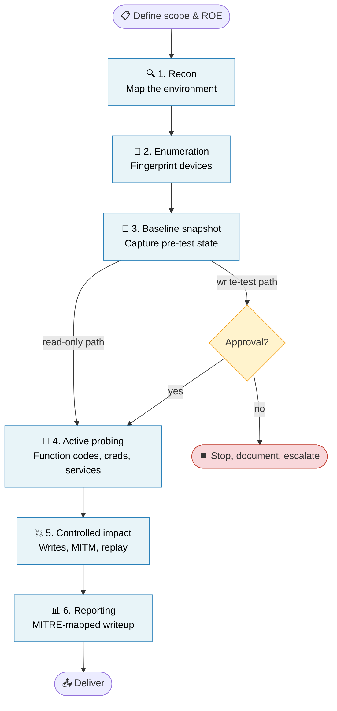
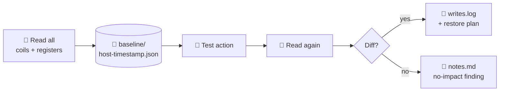

# Engagement Methodology

A repeatable workflow for assessing an ICS environment, mapped to standard frameworks.

---

## Framework Alignment

| Phase | PTES | ICS Cyber Kill Chain (SANS) | MITRE ATT&CK for ICS |
|---|---|---|---|
| 1. Recon | Intelligence Gathering | Stage 1 — Reconnaissance | TA0100 Reconnaissance |
| 2. Enumeration | Vulnerability Analysis | Stage 1 — Weaponization | TA0102 Initial Access |
| 3. Baseline | _(safety overlay)_ | _(safety overlay)_ | _(safety overlay)_ |
| 4. Active probing | Exploitation | Stage 1 — Delivery / Stage 2 — Develop | TA0104 Execution |
| 5. Process impact | Post-Exploitation | Stage 2 — Install / Execute ICS Attack | TA0107 Inhibit Response, TA0106 Impair Process Control |
| 6. Reporting | Reporting | _(post-attack analysis)_ | _(mapping)_ |

---

## The Phase-by-Phase Flow



---

## Phase 1 — Reconnaissance

**Goal:** know what's on the wire before you touch it.

**Tools:** `nmap`, `masscan`, `tcpdump`

**Inputs:** lab subnet CIDR.

**Outputs:**
- `engagements/<name>/recon/sweep.{nmap,gnmap,xml}` — host discovery
- `engagements/<name>/recon/ics-ports.{nmap,gnmap,xml}` — ICS-specific ports

```bash
# Host discovery
kali nmap -sn 192.168.1.0/24 -oA /engagements/<name>/recon/sweep

# Common ICS ports
kali nmap -sS -p 102,502,1911,4840,20000,44818,47808 --open \
  -oA /engagements/<name>/recon/ics-ports 192.168.1.0/24
```

**MITRE ATT&CK for ICS:**
- [T0846 Remote System Discovery](https://attack.mitre.org/techniques/T0846/)
- [T0840 Network Connection Enumeration](https://attack.mitre.org/techniques/T0840/)

See [`playbooks/01-recon.md`](../playbooks/01-recon.md).

---

## Phase 2 — Enumeration

**Goal:** identify each device's vendor, model, firmware, and exposed services.

**Tools:** `nmap` NSE scripts, `pymodbus`, `snmpwalk`, `nikto`, `searchsploit`

**Outputs:**
- `engagements/<name>/enumeration/<host>.md` — device fact sheet
- `engagements/<name>/enumeration/cves.md` — known-vuln cross-reference

```bash
# Modbus
kali nmap -p 502 --script modbus-discover --script-args=modbus-discover.aggressive=true <ip>

# Siemens S7
kali nmap -p 102 --script s7-info <ip>

# EtherNet/IP (Rockwell)
kali nmap -p 44818 --script enip-info <ip>

# BACnet (building automation)
kali nmap -p 47808 --script bacnet-info <ip>

# Web UI / management
kali nikto -h http://<ip>

# Known exploits
kali searchsploit <vendor> <model>
```

**MITRE ATT&CK for ICS:**
- [T0888 Remote System Information Discovery](https://attack.mitre.org/techniques/T0888/)
- [T0887 Wireless Sniffing](https://attack.mitre.org/techniques/T0887/) _(when applicable)_

See [`playbooks/02-enumeration.md`](../playbooks/02-enumeration.md).

---

## Phase 3 — Baseline Snapshot

**This is the safety overlay.** Before any write or disruptive test, capture the current state so you can prove what changed and restore it.



```bash
# Use the provided snapshot script
kali python3 /opt/scripts/snapshot.py --target <ip> \
  --out /engagements/<name>/baseline/<ip>-$(date +%Y%m%d-%H%M%S).json
```

---

## Phase 4 — Active Probing

**Goal:** find protocol weaknesses, default credentials, exposed management.

**Methodologies:**

### A. Function code mapping

Probe each Modbus function code (1-23 standard, plus diagnostic 8 sub-codes) and record which the device honors. Many devices crash on unsupported codes — that's a finding.

### B. Slave/Unit ID enumeration

```bash
kali nmap -p 502 --script modbus-discover \
  --script-args 'modbus-discover.aggressive=true' <ip>
```

### C. Address space walk

Read coils/registers across 0-65535 in blocks; map the populated address space.

### D. Default credentials

| Vendor | Common defaults |
|---|---|
| Siemens | `admin:admin`, `1234`, blank |
| Allen-Bradley | `Administrator:` (blank) |
| Schneider | `USER:USER` |
| ABB | `ABB:ABB` |

```bash
kali hydra -L users.txt -P passwords.txt <ip> http-get
```

### E. SNMP

```bash
kali snmpwalk -v2c -c public <ip>
kali snmpwalk -v2c -c private <ip>   # often left enabled
```

**MITRE ATT&CK for ICS:**
- [T0855 Unauthorized Command Message](https://attack.mitre.org/techniques/T0855/)
- [T0859 Valid Accounts](https://attack.mitre.org/techniques/T0859/)
- [T0846 Remote System Discovery](https://attack.mitre.org/techniques/T0846/)

See [`playbooks/03-modbus-ops.md`](../playbooks/03-modbus-ops.md).

---

## Phase 5 — Controlled Process Impact

⚠️ **Requires explicit authorization for each test.** Snapshot first. Log every action.

### Tests covered

| Test | Tools | Likely effect | MITRE |
|---|---|---|---|
| Register write | `pymodbus` | Changes process value | [T0836](https://attack.mitre.org/techniques/T0836/) Modify Parameter |
| Force-listen-only | Modbus FC 8 sub 4 | PLC stops accepting writes | [T0855](https://attack.mitre.org/techniques/T0855/) |
| Restart comms | Modbus FC 8 sub 1 | Modbus stack reset | [T0816](https://attack.mitre.org/techniques/T0816/) Device Restart/Shutdown |
| Session flood | `hping3 --flood` | DoS via connection exhaustion | [T0814](https://attack.mitre.org/techniques/T0814/) Denial of Service |
| MITM (HMI↔PLC) | `arpspoof` + `ettercap` | Modify values in flight | [T0830](https://attack.mitre.org/techniques/T0830/) Adversary-in-the-Middle |
| Replay attack | `tcpreplay` | Reissue captured commands | [T0856](https://attack.mitre.org/techniques/T0856/) Spoof Reporting Message |

See:
- [`playbooks/04-mitm.md`](../playbooks/04-mitm.md)
- [`playbooks/05-dos.md`](../playbooks/05-dos.md)

---

## Phase 6 — Reporting

The deliverable proves the work was done and gives the asset owner something actionable.

**Structure:**

1. Executive summary (one page, no jargon)
2. Scope, methodology, dates
3. Findings — each one:
   - Description
   - MITRE ATT&CK for ICS technique ID
   - Evidence (screenshot, capture, log snippet)
   - Risk rating
   - Remediation
4. Appendices — raw nmap output, pcaps, scripts used

Templates live in [`reports/templates/`](../reports/templates/).

See [`playbooks/06-reporting.md`](../playbooks/06-reporting.md).

---

## Engagement Folder Layout

```
engagements/<engagement-name>/
├── recon/         # nmap, masscan output (all formats: .nmap .gnmap .xml)
├── enumeration/   # device fingerprints, banner grabs, CVE notes
├── baseline/      # JSON snapshots of register state, named by host+timestamp
├── pcap/          # tcpdump captures
├── exploits/      # POCs, custom scripts
├── evidence/      # screenshots, before/after diffs
├── writes.log     # every write op, with target, value, restore command
├── attck.md       # MITRE ATT&CK for ICS mapping table
├── notes.md       # narrative timeline of everything done
└── REPORT.md      # rendered deliverable
```

---

## Rules of Engagement

These are non-negotiable. They are what separates research from harm.

1. **Authorization in writing.** Even on your own lab — write down the scope.
2. **Read-only by default.** Every write needs explicit approval *for that test*.
3. **Snapshot before write.** No exceptions.
4. **Log every command.** `notes.md` is append-only.
5. **Stay in scope.** Confirm IPs against the scope before each command.
6. **Stop on uncertainty.** When something looks wrong, halt and assess.
7. **Preserve evidence.** Never delete logs or captures during an engagement.

---

## See Also

- [`SAFETY.md`](SAFETY.md) — full ROE
- [`TOOLING.md`](TOOLING.md) — what each tool is for and when to use it
- [`../playbooks/`](../playbooks/) — step-by-step recipes for each phase
- [`../reports/templates/`](../reports/templates/) — deliverable templates
