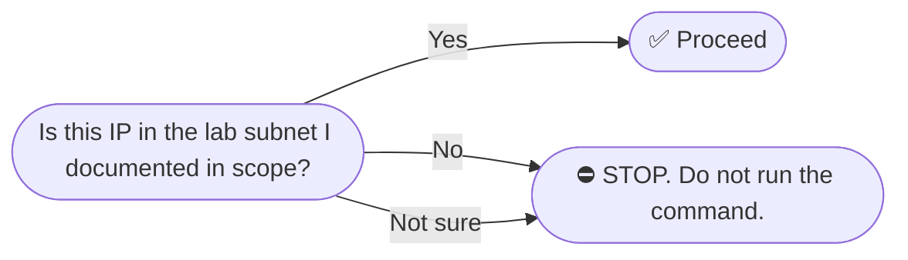
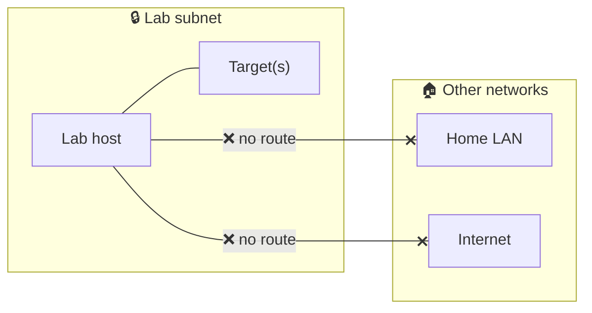

# Safety & Rules of Engagement

OT security testing is unique because **the assets under test control physical processes**. A misfired test isn't a stack trace — it's a valve that opens when it shouldn't, a pump that runs dry, a motor that overspeeds.

This document is the bright-line rules. Read it before you run anything more invasive than `nmap -sn`.

---

## 🚦 The Three Bright Lines

### 🛑 Bright line #1 — No production targets



If you cannot point at the line in `engagements/<name>/scope.md` that lists the target IP, **stop**. No exceptions for "just a quick test".

### 🛑 Bright line #2 — Snapshot before any write

Any command that could change device state — Modbus writes, FC 8 diagnostic subcodes, configuration changes, firmware uploads, restart commands — requires:

1. A captured baseline snapshot under `engagements/<name>/baseline/`
2. A logged restore command in `engagements/<name>/writes.log`
3. Verification after the test that the restore worked

### 🛑 Bright line #3 — One destructive test at a time

Do not chain destructive tests. Run one, observe, document, restore, then consider the next. Layered failures are how labs turn into expensive paperweights.

---

## What "Destructive" Means in OT

In IT pentesting, "destructive" usually means data loss. In OT, it means:

| Action | Possible consequence |
|---|---|
| Writing to the wrong coil | Pump starts unexpectedly |
| Writing to the wrong register | Setpoint changes, process deviates |
| FC 8 sub 1 (Restart Communications) | PLC offline 5-30 seconds, watchdog may trip |
| FC 8 sub 4 (Force Listen Only) | PLC ignores all writes until manually reset |
| Modbus session flood | PLC reboots, watchdog fault |
| ARP spoofing | Network segment broken until ARP caches clear |
| Firmware write | Device bricked |

In a lab, the consequence is usually "rebuild the simulator". In production, the consequence is **people get hurt or things break that take days to fix**.

---

## Pre-Flight Checklist (run mentally before every active command)

- [ ] Is the target IP in `scope.md`?
- [ ] Is this a read-only command? If not, do I have explicit approval?
- [ ] Have I snapshotted the baseline?
- [ ] Am I logging to `notes.md`?
- [ ] Do I have a documented restore plan?
- [ ] If this fails badly, what is my rollback?

---

## Lab Hygiene

### Network isolation



**Test it.** From the lab host:

```bash
# Should fail (no route)
ping -c 1 -W 2 1.1.1.1
ping -c 1 -W 2 <your-home-router-ip>

# Should succeed
ping -c 1 -W 2 <lab-target-ip>
```

### Container isolation

The `kali-red` container runs with `--network host`, `--cap-add NET_RAW`, and `--cap-add NET_ADMIN`. **This is privileged-equivalent for networking.**

- The container can do anything the host can do on the network.
- Treat the lab host as a single trust boundary. Do not put production data on it.
- Do not give untrusted users SSH access to the lab host.

### Data hygiene

- Engagement folders may contain credentials harvested from misconfigured devices. Treat `engagements/` as sensitive.
- `.gitignore` should exclude `engagements/` — never commit captures, pcaps, or credentials to a public repo.
- Scrub reports before publishing: hostnames, IPs of real devices, screenshots with serial numbers.

---

## Authorization Template

For every engagement, create `engagements/<name>/scope.md`:

```markdown
# Scope — <engagement-name>

**Authorized by:** <your-name>
**Date:** YYYY-MM-DD
**Lab description:** <one sentence>

## In scope
- 192.168.1.95 (pymodbus simulator)
- 192.168.1.20 (OpenPLC instance)

## Out of scope
- Everything else

## Authorized actions
- [x] Recon (nmap, masscan, passive capture)
- [x] Enumeration (NSE scripts, banner grabs, SNMP)
- [x] Read-only Modbus operations
- [ ] Modbus writes — requires per-test approval
- [ ] DoS testing — requires per-test approval
- [ ] MITM — requires per-test approval

## Authorized hours
<e.g. anytime — lab only>

## Stop conditions
- Any device behavior I don't understand
- Any test affecting devices outside this scope
- Any sign the lab subnet is leaking to other networks
```

---

## When Things Go Wrong

### A device stops responding

1. **Stop all active commands.**
2. Check whether the host is still reachable (`ping`).
3. If the device is a simulator container, restart it and reload its config.
4. If a real PLC: power cycle, then check program integrity against your backup.
5. Document everything in `notes.md`.

### The container starts behaving oddly

```bash
docker logs kali-red
docker restart kali-red
# Or, full rebuild:
docker rm -f kali-red
./scripts/start-kali-red.sh
```

### You realize you ran a command against the wrong IP

1. Stop everything.
2. Document exactly what was sent.
3. If it was read-only: log it as a finding and move on.
4. If it was a write: figure out whether you can/should restore. Be honest in the report.

---

## Legal & Ethical Considerations

This is a lab. The rules below apply when you take these skills outside the lab.

- **Get authorization in writing** before any test on systems you don't own.
- **Know your jurisdiction.** Computer-misuse laws vary. The same test can be legal in one country and a felony in another.
- **The fact that a device has no authentication doesn't make probing it legal.**
- **OT/ICS testing on critical infrastructure** is regulated. Power, water, transport, healthcare — these have their own rules.

This repo provides tools and knowledge. **You are responsible for how you use them.**

---

## Reporting Mistakes

If you, while using this lab, discover a vulnerability in a real product (pymodbus, OpenPLC, etc.):

1. Don't publish it on the lab repo.
2. Contact the vendor through their disclosure process.
3. Follow coordinated disclosure timelines.

---

## See Also

- [`METHODOLOGY.md`](METHODOLOGY.md) — phase-by-phase workflow with safety overlays
- [`ARCHITECTURE.md`](ARCHITECTURE.md) — the security model in detail
