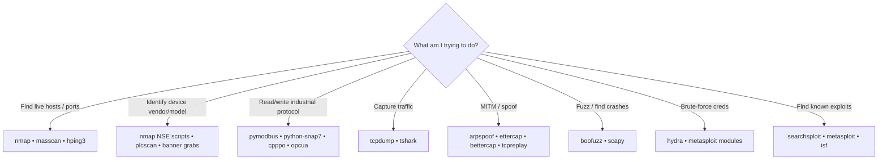

# Tooling Reference

Everything installed in `kali-red`, what it does, and when to reach for it.

---

## Decision Tree



---

## Network & Generalist

### `nmap`
The workhorse. SYN scans, service detection, NSE scripts.

| Use | Command |
|---|---|
| Host sweep | `nmap -sn <cidr>` |
| TCP full + services | `nmap -sS -sV -p- <ip>` |
| ICS ports | `nmap -sS -p 102,502,1911,4840,20000,44818,47808 --open <cidr>` |
| Modbus discovery | `nmap -p 502 --script modbus-discover --script-args modbus-discover.aggressive=true <ip>` |
| Vuln NSE | `nmap --script vuln -p 502 <ip>` |

Save all outputs with `-oA <basename>` (gives `.nmap`, `.gnmap`, `.xml`).

### `masscan`
Faster than nmap for wide-net discovery. Use for big subnets or class-B sweeps.

```bash
masscan 192.168.0.0/16 -p502 --rate 1000 -oG masscan.gnmap
```

⚠️ Easy to overwhelm fragile devices — keep `--rate` low (≤1000) in ICS networks.

### `hping3`
Custom packet crafting and basic flooding.

```bash
hping3 -S -p 502 -c 5 <ip>           # 5 SYN packets to :502
hping3 -S -p 502 --flood <ip>        # DoS test ⚠️
```

### `tcpdump`
Bread-and-butter packet capture.

```bash
tcpdump -i any -w cap.pcap 'port 502 or port 102 or port 44818'
```

### `tshark`
Wireshark CLI. Best for analyzing existing pcaps.

```bash
tshark -r cap.pcap -Y modbus -T fields -e ip.src -e ip.dst -e modbus.func_code | sort -u
```

---

## ICS Protocol Stacks (Python)

### `pymodbus`
Primary Modbus TCP/RTU client. Used for reads, writes, function-code probing.

```python
from pymodbus.client import ModbusTcpClient
c = ModbusTcpClient('192.168.1.95', port=502)
c.connect()
print(c.read_holding_registers(0, 10, slave=1).registers)
c.close()
```

Console mode for interactive use:

```bash
pymodbus.console tcp --host 192.168.1.95 --port 502
```

### `python-snap7`
Siemens S7 communications. Use against S7-300/400/1200/1500.

```python
import snap7
c = snap7.client.Client()
c.connect('192.168.1.20', 0, 1)
db = c.db_read(1, 0, 16)
```

### `cpppo`
EtherNet/IP and CIP — Rockwell / Allen-Bradley.

```bash
python3 -m cpppo.server.enip.client --address 192.168.1.30 --print 'TAG1, TAG2'
```

### `opcua`
OPC UA client — modern industrial middleware.

```python
from opcua import Client
c = Client('opc.tcp://192.168.1.40:4840')
c.connect()
root = c.get_root_node()
```

### `pysnmp`
SNMP client. Many PLCs leave SNMP open with default community strings.

### `scapy`
General-purpose packet crafter. Use to build arbitrary Modbus/S7/EtherNet/IP packets when off-the-shelf tools won't do.

### `boofuzz`
Network protocol fuzzer. Build a Modbus function-code fuzzer in 50 lines.

---

## MITM / Replay

### `arpspoof` (dsniff suite)
ARP poisoning to position yourself between HMI and PLC.

```bash
arpspoof -i eth0 -t <HMI_IP> -r <PLC_IP>
```

### `ettercap`
Full MITM framework with protocol filters.

```bash
ettercap -T -M arp:remote /<HMI_IP>// /<PLC_IP>//
```

### `bettercap`
Modern MITM toolkit, better for active modification.

### `tcpreplay`
Re-send captured pcap traffic.

```bash
tcpreplay -i eth0 captured_hmi_commands.pcap
```

---

## Web / Generic Exploitation

### `nikto`
Web server scanner. PLCs often have web management UIs full of CVEs.

```bash
nikto -h http://<plc-ip>
```

### `hydra`
Login brute-forcer. Use against PLC web UIs, Telnet, FTP, SSH.

```bash
hydra -L users.txt -P passwords.txt <ip> http-get /
```

### `sqlmap`
SQL injection automation. Some HMI web apps have horrible backends.

### `metasploit-framework`
Includes ICS-specific aux modules:

```
use auxiliary/scanner/scada/modbusdetect
use auxiliary/scanner/scada/modbusclient
use auxiliary/admin/scada/modicon_command
```

Search: `search type:auxiliary scada`

### `searchsploit` (exploitdb)
Local CVE → exploit database lookup.

```bash
searchsploit modbus
searchsploit siemens s7
searchsploit "allen bradley"
```

### `snmpwalk`, `snmpcheck`
SNMP enumeration. Try `public` and `private` community strings first.

---

## Specialized ICS Tooling (in `/opt/`)

### `/opt/isf` — Industrial Exploitation Framework
Metasploit-style framework focused on ICS. Modules for Siemens, Schneider, Allen-Bradley, GE.

```bash
cd /opt/isf && python3 isf.py
```

### `/opt/plcscan`
Quick Modbus + S7 device discovery & identification.

```bash
cd /opt/plcscan && python3 plcscan.py 192.168.1.0/24
```

### `/opt/ics-scripts`
Tijl Deneut's collection — Siemens S7 scripts, OPC UA tooling, more.

---

## When Tools Compete

| Job | Pick | Why |
|---|---|---|
| Subnet sweep | `nmap -sn` | Slower than masscan but politer to fragile devices |
| Wide port sweep | `masscan` | Faster, but rate-limit it |
| Modbus reads | `pymodbus` console | Most flexible |
| Modbus quick check | `nmap modbus-discover` | One command, structured output |
| Modbus writes | Custom Python with `pymodbus` | Easier to log and snapshot than msfconsole |
| Modbus exploitation in pen-test | Metasploit `scada` modules | Standardized output for reports |
| Capture | `tcpdump` | Lighter, more reliable than tshark for live capture |
| Analyze pcap | `tshark` | Better protocol decoding than tcpdump |
| MITM small flows | `arpspoof` + custom proxy | Simpler than ettercap for one-off |
| MITM with rules | `ettercap` or `bettercap` | Built-in filters/scripts |

---

## What's Deliberately Not Installed

| Tool | Why not |
|---|---|
| `wireshark` (GUI) | Container is headless — use `tshark` |
| `smod` | Upstream repos rotted; functionality covered by pymodbus + boofuzz |
| `scapy-modbus` | Upstream gone; scapy + a custom Modbus layer is equivalent |
| Most C2 frameworks | Out of scope for OT recon/probing |

---

## Updating

```bash
docker build --pull -t kali-red:latest docker/kali-red/
docker rm -f kali-red
./scripts/start-kali-red.sh
```

This pulls the latest Kali base and rebuilds. The `--pull` flag is important — without it Docker reuses the cached base image.

---

## See Also

- [`METHODOLOGY.md`](METHODOLOGY.md) — when in each engagement phase to use what
- [`../playbooks/`](../playbooks/) — concrete recipes
