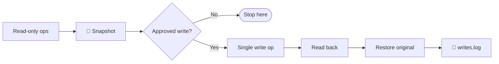

# Playbook 03 — Modbus Operations

**Goal:** Read process variables; map function-code support; (with approval) test writes.

**Time:** 15-30 minutes

**Risk:** Reads — low. Writes — can change physical process state.

---

## Safety Overlay



**Before any write:**
1. Run `scripts/snapshot.py`
2. Have a documented restore command
3. Log to `writes.log` *before* the write, not after

---

## Reading

### Holding registers (FC 3)

```bash
TARGET=192.168.1.95

kali -c "python3 -c \"
from pymodbus.client import ModbusTcpClient as M
c = M('$TARGET', port=502); c.connect()
r = c.read_holding_registers(0, 20, slave=1)
print(r.registers if not r.isError() else r)
c.close()\""
```

### Coils (FC 1)

```bash
kali -c "python3 -c \"
from pymodbus.client import ModbusTcpClient as M
c = M('$TARGET', port=502); c.connect()
r = c.read_coils(0, 16, slave=1)
print(r.bits if not r.isError() else r)
c.close()\""
```

### Interactive console

```bash
kali pymodbus.console tcp --host $TARGET --port 502
```

Inside:

```
client.read_coils(0, 16, slave=1)
client.read_holding_registers(0, 32, slave=1)
client.read_input_registers(0, 32, slave=1)
client.read_discrete_inputs(0, 16, slave=1)
```

### Address-space walk

```bash
kali -c "python3 -c \"
from pymodbus.client import ModbusTcpClient as M
c = M('$TARGET', port=502); c.connect()
for base in range(0, 1000, 100):
    r = c.read_holding_registers(base, 100, slave=1)
    if not r.isError():
        print(f'{base:5d}: {r.registers}')
c.close()\""
```

## Baseline Snapshot

```bash
kali python3 /opt/scripts/snapshot.py \
  --target $TARGET --slave 1 --count 100 \
  --out /engagements/<name>/baseline/$TARGET-$(date -u +%Y%m%dT%H%M%SZ).json
```

## Function-Code Mapping

Test which Modbus FCs the device honors:

```bash
kali -c "python3 -c \"
from pymodbus.client import ModbusTcpClient as M
c = M('$TARGET', port=502); c.connect()
tests = [
  ('FC1 read_coils',           lambda: c.read_coils(0, 1, slave=1)),
  ('FC2 read_discrete_inputs', lambda: c.read_discrete_inputs(0, 1, slave=1)),
  ('FC3 read_holding_regs',    lambda: c.read_holding_registers(0, 1, slave=1)),
  ('FC4 read_input_regs',      lambda: c.read_input_registers(0, 1, slave=1)),
]
for name, fn in tests:
    try:
        r = fn(); print(f'{name}: {\\\"OK\\\" if not r.isError() else r}')
    except Exception as e: print(f'{name}: EXC {e}')
c.close()\""
```

## Slave ID Enumeration

```bash
kali nmap -p 502 \
  --script modbus-discover \
  --script-args 'modbus-discover.aggressive=true' \
  $TARGET
```

The `aggressive=true` flag walks slave IDs 1-247.

---

## Writes — ⚠️ Approval Required

**Before running anything below:**
1. Confirm explicit authorization for this specific test
2. Run a fresh snapshot
3. Document the restore command in `writes.log` *before* executing

### Write single coil (FC 5)

```bash
ENG=/engagements/<name>
LOG=$ENG/writes.log

# Snapshot
kali python3 /opt/scripts/snapshot.py --target $TARGET --out $ENG/baseline/pre-write-$(date -u +%s).json

# Log the planned write FIRST
echo "$(date -u +%Y-%m-%dT%H:%M:%SZ) WRITE coil 0 = True (slave 1) target=$TARGET" >> $LOG

# Execute
kali -c "python3 -c \"
from pymodbus.client import ModbusTcpClient as M
c = M('$TARGET', port=502); c.connect()
print(c.write_coil(0, True, slave=1))
c.close()\""

# Verify
kali -c "python3 -c \"
from pymodbus.client import ModbusTcpClient as M
c = M('$TARGET', port=502); c.connect()
print('after:', c.read_coils(0, 1, slave=1).bits)
c.close()\""

# Restore (use the snapshot value)
# echo restore command to LOG, then run
```

### Metasploit alternative

```bash
kali msfconsole -q -x "
use auxiliary/scanner/scada/modbusclient;
set RHOSTS $TARGET;
set ACTION READ_COILS;
set NUMBER 16;
run;
exit"
```

---

## MITRE ATT&CK for ICS

- Reads: [T0888 Remote System Information Discovery](https://attack.mitre.org/techniques/T0888/)
- Writes: [T0836 Modify Parameter](https://attack.mitre.org/techniques/T0836/), [T0855 Unauthorized Command Message](https://attack.mitre.org/techniques/T0855/)

## Next

→ [Playbook 04 — MITM](04-mitm.md)
